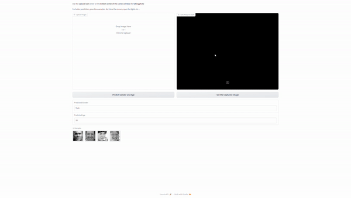
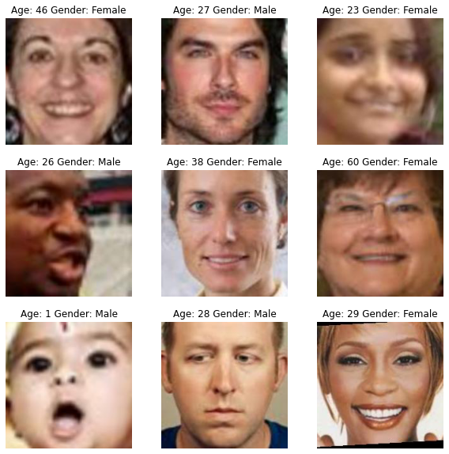
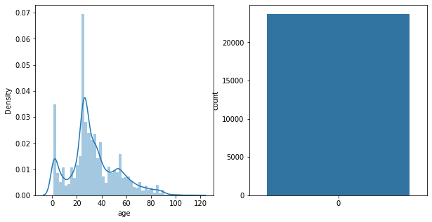
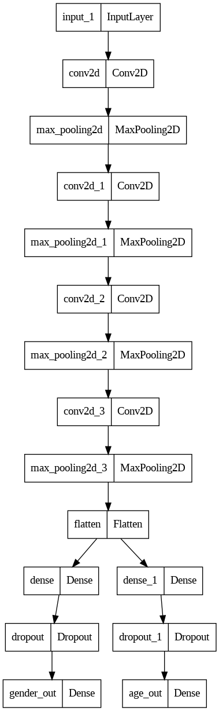
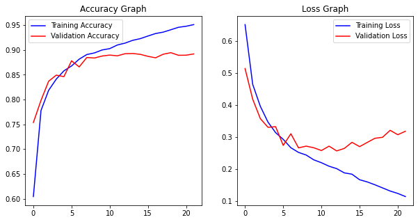

<div style="position: absolute; top: 0; right: 0;">
    <a href="ertugrulbusiness@gmail.com"></a>
    <a href="https://tr.linkedin.com/in/ertu%C4%9Fruldemir?original_referer=https%3A%2F%2Fwww.google.com%2F"></a>
    <a href="https://github.com/ertugruldmr"></a>
    <a href="https://www.kaggle.com/erturuldemir"></a>
    <a href="https://huggingface.co/ErtugrulDemir"></a>
    <a href="https://stackoverflow.com/users/21569249/ertu%c4%9frul-demir?tab=profile"></a>
    <a href="https://medium.com/@ertugrulbusiness"></a>
    <a href="https://www.youtube.com/channel/UCB0_UTu-zbIsoRBHgpsrlsA"></a>
</div>

# Pet Image Segmentation
 
## __Table Of Content__
- (A) [__Brief__](#brief)
  - [__Project__](#project)
  - [__Data__](#data)
  - [__Demo__](#demo) -> [Live Demo](https://ertugruldemir-ageandgenderpredict.hf.space)
  - [__Study__](#problemgoal-and-solving-approach) -> [Colab](https://colab.research.google.com/drive/1uTLVmW9fuwOlF4tMI4Ltpencu-y_oyuW)
  - [__Results__](#results)
- (B) [__Detailed__](#Details)
  - [__Abstract__](#abstract)
  - [__Explanation of the study__](#explanation-of-the-study)
    - [__(A) Dependencies__](#a-dependencies)
    - [__(B) Dataset__](#b-dataset)
    - [__(C) Modelling__](#c-modelling)
    - [__(D) Deployment as web demo app__](#d-deployment-as-web-demo-app)
  - [__Licance__](#license)
  - [__Connection Links__](#connection-links)
  - NOTE: The model file exceeded limitations. you can download it from this [link](https://huggingface.co/spaces/ErtugrulDemir/AgeAndGenderPredict/resolve/main/GenAgeModel.zip).

## __Brief__ 

### __Project__ 
- This is an project which uses __multi model__ architectured model on image data  as  __hybrid model__.The project uses the  [__UTKFace Dataset__](https://www.kaggle.com/datasets/jangedoo/utkface-new) to __predict the age and gender__ of any person from image.
- The __goal__ is build a deep learning model that accurately __predicting the age and gender__ of any person from image..
- The performance of the model is evaluated using several __metrics__ loss and accuracy metrics.

#### __Overview__
- This project involves building a deep learning model to predict the age and gender of any person from image.  The dataset consists of over 20,000 face images with annotations of age, gender, and ethnicity. The images cover large variation in pose, facial expression, illumination, occlusion, resolution, etc..., .  The models selected according to model tuning results, the progress optimized respectively the previous tune results. The project uses Python and several popular libraries such as Pandas, NumPy, tensorflow.

#### __Demo__

<div align="left">
  <table>
    <tr>
    <td>
        <a target="_blank" href="https://ertugruldemir-ageandgenderpredict.hf.space" height="30">[Demo app] HF Space</a>
      </td>
      <td>
        <a target="_blank" href="https://colab.research.google.com/drive/1_xEIpvFcWa6yZpIwjPbBYS_ED16BMNoY">[Demo app] Run in Colab</a>
      </td>
      <td>
        <a target="_blank" href="https://github.com/ertugruldmr/AgeAndGenderPrediction/blob/main/study.ipynb
">[Traning pipeline] source on GitHub</a>
      </td>
    <td>
        <a target="_blank" href="https://colab.research.google.com/drive/1uTLVmW9fuwOlF4tMI4Ltpencu-y_oyuW">[Traning pipeline] Run in Colab</a>
      </td>
    </tr>
  </table>
</div>


- Description
    -  __Predict the age and gender__ of any person from image.
    - __Usage__: 
      - upload your image then click the 'Predict Gender and Age' button to get results.
      - If you want to use your webcame,
        - you must give the required permission from you browser 
        - then use 'Set the Captured Image' button to get an image from webcam video stream.
        - Edit the image like 'Usage Gif' example. If you do like it the prediction will be more accurate.
          - If you want to know how to edit the image, clik the 'Show Usage Gif for meaningful predictions' button then watch the process. Just do samething for best results.
          - Details of the edit.
            - Focus the face.
            - upper side of image : forehead
            - lower side of image : chin
            - lef and right side border: ears
    - Usage
      <div style="text-align: center;">
        
      </div>
- Embedded [Demo](https://ertugruldemir-ageandgenderpredict.hf.space) window from HuggingFace Space
    

<iframe
	src="https://ertugruldemir-ageandgenderpredict.hf.space"
	frameborder="0"
	width="850"
	height="450"
></iframe>

#### __Data__
- The [__UTKFace Dataset__](https://www.kaggle.com/datasets/jangedoo/utkface-new) from kaggle dataset api.
- The dataset consists of over 20,000 face images with annotations of age, gender, and ethnicity. 
- The images cover large variation in pose, facial expression, illumination, occlusion, resolution, etc..., .
  - Example Dataset
      <div style="text-align: center;">
        
      </div>
  - Target Distributions
      <div style="text-align: center;">
        
      </div>


#### Problem, Goal and Solving approach
- This is an __multi model prediction__ problem  that uses the [__UTKFace Dataset__](https://www.kaggle.com/datasets/jangedoo/utkface-new)  to __predict the age and gender__ from given image.
- The __goal__ is build a deep learning  model that accurately __predict the age and gender__ from images.
- __Solving approach__ is that using the supervised deep learning models. Basic Custom convolutional model is used for predict the age and gender. 

#### Study
The project aimed predicting the age and gender using deep learning model architecture. The study includes following chapters.
- __(A) Dependencies__: Installations and imports of the libraries.
- __(B) Dataset__: Downloading and loading the dataset. Preparing the dataset via tensorflow dataset api. Configurating the dataset performance and related pre-processes. 
- __(C) Preprocessing__: Type casting, value range scaling, resizing, creating dataset object according to multi model form, configurating the dataset object, batching, performance setting, visualizating, Implementing augmentation methods on train dataset and image related processes.
- __(D) Modelling__:
  - Model Architecture
    - Custom convolutional neural network used sa generator and another custom convolutional network used for discriminator model.
    - Custom Convolutional Model Archirecture
      <div style="text-align: center;">
        
      </div>
  - Training
    - Callbakcs and trainin params are setted. some of the callbacks are EarlyStopping, ModelCheckpoint, Tensorboard etc....  
    - Training history
      <div style="text-align: center;">
        
      </div>        
  - Saving the model
    - Saved the model as tensorflow saved model format.
- __(E) Deployment as web demo app__: Creating Gradio Web app to Demostrate the project.Then Serving the demo via huggingface as live.

#### results
- The final model is __GenAgeModel__ as Custom Convolutional Network because of the results and less complexity.
  -  Custom Convolutional Network
        <table><tr><th>Model Results </th><th></th></tr><tr><td>
  |   | loss  | gender_out_loss | age_out_loss | gender_out_accuracy | age_out_accuracy | val_loss | val_gender_out_loss | val_age_out_loss | val_gender_out_accuracy | val_age_out_accuracy |
  |---|-------|----------------|--------------|---------------------|-----------------|----------|---------------------|------------------|--------------------------|----------------------|
  |   | 4.3431| 0.1133         | 4.2299       | 0.9512              | 0.0471          | 6.7234   | 0.3178              | 6.4056           | 0.8920                   | 0.0472               |
    </td></tr></table>

## Details

### Abstract
- [__UTKFace Dataset__](https://www.kaggle.com/datasets/jangedoo/utkface-new) is used to predict age and gender of any person from images.   The dataset consists of over 20,000 face images with annotations of age, gender, and ethnicity. The images cover large variation in pose, facial expression, illumination, occlusion, resolution, etc..., . The goal is predicting age and gender of any person fron images using through custom deep learning algorithms or related training approachs of pretrained state of art models.The study includes creating the environment, getting the data, preprocessing the data, exploring the data, agumenting the data, modelling the data, saving the results, deployment as demo app. Training phase of the models implemented through tensorflow callbacks. After the custom model traininigs, transfer learning and fine tuning approaches are implemented. Selected the basic and more succesful when comparet between other models  is  custom convolutional generative model.__Custom Convolutional Network__ model  has __4.3431__ loss,  other metrics are also found the results section. Created a demo at the demo app section and served on huggingface space.  


### File Structures

- File Structure Tree
```bash
├── demo_app
│   ├── app.py
│   ├── GenAgeModel
│   ├── model_downloading_instructions.txt
│   ├── requirements.txt
│   └── samples
├── docs
│   └── images
├── env
│   ├── env_installation.md
│   └── requirements.txt
├── LICENSE
├── readme.md
└── study.ipynb
```
- Description of the files
  - demo_app/
    - Includes the demo web app files, it has the all the requirements in the folder so it can serve on anywhere.
  - demo_app/GANModel_Weights:
    - Custom Convolutional Model Which saved as tensorflow saved_model format.
  - demo_app/model_downloading_instructions
    - It is an instriction for downloading the model from hugging face repository. The model side exceed github limitations so alternative ways are implemented. For getting the model, just follow the instruction.
  - demo_app/requirements.txt
    - It includes the dependencies of the demo_app.
  - docs/
    - Includes the documents about results and presentations
  - env/
    - It includes the training environmet related files. these are required when you run the study.ipynb file.
  - LICENSE.txt
    - It is the pure apache 2.0 licence. It isn't edited.
  - readme.md
    - It includes all the explanations about the project
  - study.ipynb
    - It is all the studies about solving the problem which reason of the dataset existance.    

### Explanation of the Study
#### __(A) Dependencies__:
  - There is a third part installation as kaggle dataset api, just follow the study code order it will solve the depencies. You can create an environment via env/requirements.txt. Create a virtual environment then use hte following code. It is enough to satisfy the requirements for runing the study.ipynb which training pipeline.
  - Dataset can download from tensoflow.
#### __(B) Dataset__: 
  - Downloading the [__UTKFace Dataset__](https://www.kaggle.com/datasets/jangedoo/utkface-new)  via kaggle dataset api. 
  - The dataset consists of over 20,000 face images with annotations of age, gender, and ethnicity. The images cover large variation in pose, facial expression, illumination, occlusion, resolution, etc..., .
  - Preparing the dataset via resizing, scaling into 0-1 value range, implementing data augmentation and etc image preprocessing processes. 
  - Creating the tensorflow dataset object then configurating.
  - Example Images
    - Example Dataset
        <div style="text-align: center;">
          
        </div>
    - Target Distributions
        <div style="text-align: center;">
          
        </div>
#### __(C) Modelling__: 
  - The processes are below:
    - Model Architecture
      - Custom convolutional neural network used sa generator and another custom convolutional network used for discriminator model.
      - Custom Convolutional Model Archirecture
        <div style="text-align: center;">
          
        </div>
    - Training
      - Callbakcs and trainin params are setted. some of the callbacks are EarlyStopping, ModelCheckpoint, Tensorboard etc....  
      - Training history
        <div style="text-align: center;">
          
        </div>        
    - Saving the model
      - Saved the model as tensorflow saved model format.
  - __(E) Deployment as web demo app__: Creating Gradio Web app to Demostrate the project.Then Serving the demo via huggingface as live.

  #### results
  - The final model is __GenAgeModel__ as Custom Convolutional Network because of the results and less complexity.
    -  Custom Convolutional Network
          <table><tr><th>Model Results </th><th></th></tr><tr><td>
    |   | loss  | gender_out_loss | age_out_loss | gender_out_accuracy | age_out_accuracy | val_loss | val_gender_out_loss | val_age_out_loss | val_gender_out_accuracy | val_age_out_accuracy |
    |---|-------|----------------|--------------|---------------------|-----------------|----------|---------------------|------------------|--------------------------|----------------------|
    |   | 4.3431| 0.1133         | 4.2299       | 0.9512              | 0.0471          | 6.7234   | 0.3178              | 6.4056           | 0.8920                   | 0.0472               |
      </td></tr></table>
    - Saving the project and demo studies.
      - trained model __GenAgeModel__ as tensorflow (keras) saved_model format.

#### __(D) Deployment as web demo app__: 
  - Creating Gradio Web app to Demostrate the project.Then Serving the demo via huggingface as live.
  - Desciption
    - Project goal is predicting age and gender of any person from given image.
    - Usage: upload or select the image for generating then use the button to predict.
  - Demo
    - The demo app in the demo_app folder as an individual project. All the requirements and dependencies are in there. You can run it anywhere if you install the requirements.txt.
    - You can find the live demo as huggingface space in this [demo link](https://ertugruldemir-ageandgenderpredict.hf.space) as full web page or you can also us the [embedded demo widget](#demo)  in this document.  
    
## License
- This project is licensed under the Apache 2.0 License. See the [LICENSE](LICENSE) file for details.

<h1 style="text-align: center;">Connection Links</h1>

<div style="text-align: center;">
    <a href="ertugrulbusiness@gmail.com"></a>
    <a href="https://tr.linkedin.com/in/ertu%C4%9Fruldemir?original_referer=https%3A%2F%2Fwww.google.com%2F"></a>
    <a href="https://github.com/ertugruldmr"></a>
    <a href="https://www.kaggle.com/erturuldemir"></a>
    <a href="https://huggingface.co/ErtugrulDemir"></a>
    <a href="https://stackoverflow.com/users/21569249/ertu%c4%9frul-demir?tab=profile"></a>
    <a href="https://www.hackerrank.com/ertugrulbusiness"></a>
    <a href="https://app.patika.dev/ertugruldmr"></a>
    <a href="https://medium.com/@ertugrulbusiness"></a>
    <a href="https://www.youtube.com/channel/UCB0_UTu-zbIsoRBHgpsrlsA"></a>
</div>

